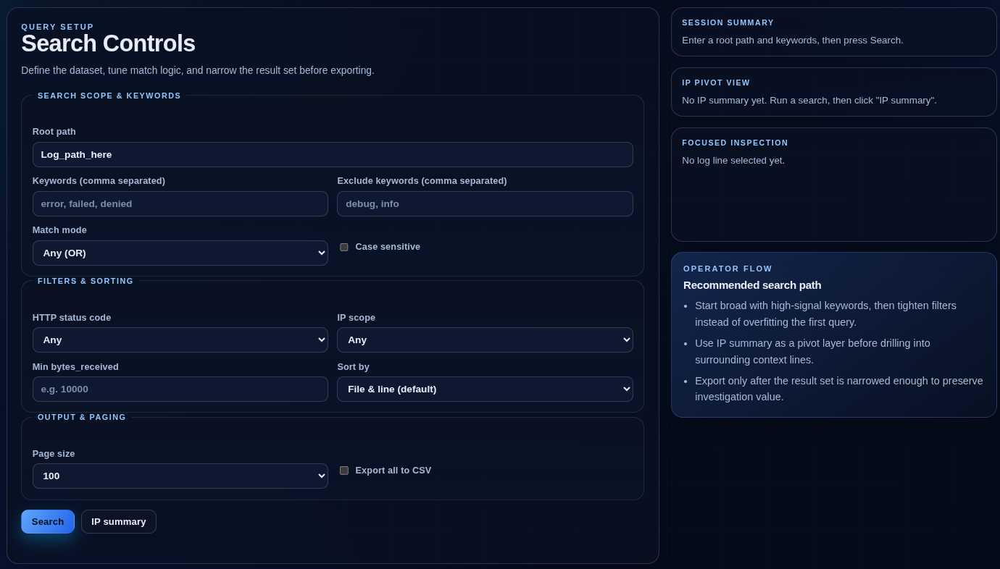

# DFIR Suite

Unified local workspace for two DFIR tools:

1. `Event Log Parser` (EVTX-focused)
2. `Log Parser` (plain-text log analytics)

Both tools are started from one launcher and exposed through one landing page.

## Contents

1. Purpose
2. Components
3. Parser Capabilities
4. Folder Structure
5. Prerequisites
6. Installation
7. Startup
8. Daily Workflow
9. Usage (Web Import)
10. URLs
11. Environment Variables
12. Troubleshooting

## Purpose

This suite provides a single local entry point for DFIR workflows, so you can:

- launch all services with one command,
- switch between EVTX and text-log workflows quickly,
- and keep analysis operations consistent across investigations.

## Components

Running `./start.sh` starts four processes:

1. EventLogParser backend (`http://localhost:8080`)
2. EventLogParser frontend (`http://localhost:3000`)
3. Log Parser service (`http://localhost:8800`)
4. Landing page server (`http://localhost:8899`)

Startup behavior:

- checks required ports (`3000`, `8080`, `8800`, `8899`)
- waits for health/availability checks before declaring success
- prints `All services started.` only after all endpoints are reachable
- cleans up child processes when you stop with `Ctrl+C`

## Parser Capabilities

### Event Log Parser (EVTX Workflow)

Best for Windows-native forensic timelines and event-channel investigations.

Core capabilities:

- Multi-threaded EVTX ingestion into SQLite.
- Structured extraction of core event fields (event ID, channel, host, user, SID, provider, timestamp, and raw XML/JSON payloads).
- Full-text event search over indexed event data.
- Filtered event retrieval by event ID, channel, user/SID, IP-related fields, include/exclude keywords, and time window.
- Timeline aggregation with minute/hour buckets.
- Stats aggregation for top event IDs, channels, users, and source/destination IPs.
- Process-focused views (including process-related event IDs).
- Detection engine driven by YAML rules with:
  - severity/metadata,
  - field-level filters,
  - regex matching,
  - correlation chains and time windows.
- Investigation/report features:
  - standard case summary report,
  - custom Markdown report from selected events,
  - custom HTML report for print/export workflows.
- Utility endpoints for suspicious events, logon failure/success summaries, and 4624/4625 correlation.

Main API surface (high-value endpoints):

- `POST /ingest`
- `GET /events`
- `GET /search`
- `GET /timeline`
- `GET /stats`
- `GET /detections`
- `POST /report`
- `POST /reports/custom`
- `POST /reports/custom/html`

### Log Parser (Plain-Text Log Workflow)

Best for high-volume web/server/application text logs and pattern-heavy hunts.

Core capabilities:

- Parallel directory scanning for `.log`, `.txt`, rotated log files, and extensionless files.
- Text search with include/exclude term sets and `any/all` match mode.
- Structured line parsing for:
  - timestamp extraction,
  - status code,
  - bytes received,
  - source/destination/public IPs.
- Filtering and sorting:
  - `status_code` filter,
  - `ip_scope` (private/public),
  - `min_bytes_received`,
  - sorting by file position or bytes ascending/descending.
- Context retrieval API to return surrounding lines around a hit.
- IP summary mode with unique counts and optional CSV export.
- Rule engine for detections with:
  - regex criteria,
  - field conditions and comparison operators,
  - threshold rules,
  - time-windowed grouping (`global/src_ip/dst_ip/status`).
- Detection persistence in SQLite:
  - rule upsert/list/disable,
  - detection run history,
  - paginated hit listing with cursor ordering,
  - false-positive marking and notes,
  - CSV export of detection hits.
- Export behavior with writable-directory fallback (`exports` -> `exports_local`).

Main API surface (high-value endpoints):

- `POST /search`
- `POST /ip_summary`
- `POST /context`
- `POST /detections/run`
- `GET /detections/rules`
- `POST /detections/rules`
- `GET /detections/hits`
- `POST /detections/hits/:id/false_positive`
- `POST /detections/export`

## Folder Structure

```text
DFIR_suite/
  ├─ setup.sh
  ├─ start.sh
  ├─ README.md
  ├─ landing/
  │   └─ index.html
  ├─ logs/
  └─ apps/
      ├─ EventLogParser/
      └─ Log_parser/
```

## Prerequisites

Required:

- `bash`
- Rust toolchain (`cargo`)
- Node.js + npm
- Python 3 (or Python)
- `curl`
- `ss` (from `iproute2`)

Recommended:

- `git`
- `rg` (ripgrep)

## Installation

Use the automated installer (recommended), then start the suite.

### Quick Setup (recommended)

From the `DFIR_suite` directory:

```bash
chmod +x setup.sh start.sh
./setup.sh
./start.sh
```

`setup.sh` installs required system/runtime dependencies, installs npm dependencies for the Event UI, and pre-fetches Rust dependencies for both parsers.

### Manual Setup (optional)

If you do not want to use `setup.sh`, follow the manual steps below.

### 1. Install Rust and Cargo (required)

Use `rustup` (recommended):

```bash
curl https://sh.rustup.rs -sSf | sh
source "$HOME/.cargo/env"
rustc --version
cargo --version
```

### 2. Install Node.js and npm (required)

Use Node.js 20 LTS or newer:

```bash
node --version
npm --version
```

### 3. Install system packages (required)

Ubuntu/Debian example:

```bash
sudo apt update
sudo apt install -y curl iproute2 python3
```

### 4. Install frontend dependencies

```bash
cd apps/EventLogParser/web
npm ci
cd ../../..
```

### 5. Verify required tools

```bash
bash --version
cargo --version
node --version
npm --version
python3 --version
curl --version
ss --version
```

## Startup

From the `DFIR_suite` directory:

```bash
./start.sh
```

If ports are already in use and you want automatic cleanup:

```bash
AUTO_KILL_PORTS=1 ./start.sh
```

If first startup is slow due to builds/dependency install:

```bash
STARTUP_TIMEOUT_SECS=900 ./start.sh
```

## Daily Workflow

1. Start services with `./start.sh`.
2. Open `http://localhost:8899`.
3. Select the tool:
   - Event-focused analysis -> Event Log Parser
   - Large text-log analysis -> Log Parser
4. Import data from the web UI (see `Usage (Web Import)` below).
5. Run analysis and exports.
6. Stop all services with `Ctrl+C`.

## Usage (Web Import)

Store documentation screenshots under `docs/images/` to keep the project root clean.

### EVTX Parser (EventLogParser) Import Flow

1. Open `http://localhost:3000`.
2. Go to `Ingest`.
3. In `EVTX folder path`, enter your EVTX directory (for example `event_log` or an absolute path).
4. Click `List`.
5. Select one or more files from the table.
6. Click `Ingest Selected`.
7. After ingest completes, move to `Events`, `Search`, `Timeline`, or `Detections`.


### Log Parser Import Flow

1. Open `http://localhost:8800`.
2. In `Root path`, enter the directory containing your log files.
3. Optionally set keywords, exclusions, status/IP filters, and page size.
4. Click `Search` to parse and load results.
5. For detections, open `Detection`, provide/select rules, then run detection.



## URLs

- Landing page: `http://localhost:8899`
- Event Parser UI: `http://localhost:3000`
- Event Parser API: `http://localhost:8080`
- Log Parser UI/API: `http://localhost:8800`
- Log Parser health check: `http://localhost:8800/healthz`

## Environment Variables

Supported by `start.sh`:

- `AUTO_KILL_PORTS`
  - `0` (default): fail when a required port is in use
  - `1`: terminate existing listeners on required ports and continue
- `STARTUP_TIMEOUT_SECS`
  - startup wait timeout
- `RUST_LOG`
  - Rust logging level
- `EVTX_DB_PATH`
  - Event parser DB file path
- `NEXT_PUBLIC_API_BASE`
  - Event frontend API base URL
- `BIND_ADDRESS`
  - Log Parser bind address

## Troubleshooting

### Port Already In Use

Run:

```bash
AUTO_KILL_PORTS=1 ./start.sh
```

### A Service Fails During Startup

Check runtime logs:

```bash
tail -n 120 logs/event_backend.log
tail -n 120 logs/event_frontend.log
tail -n 120 logs/log_parser.log
tail -n 120 logs/landing.log
```

### Event Frontend Dependency Issue

```bash
cd apps/EventLogParser/web
npm ci
```

### Slow First Run

Expected on first run:

- Rust compilation
- Node package installation

Use a larger timeout if needed:

```bash
STARTUP_TIMEOUT_SECS=1200 ./start.sh
```
